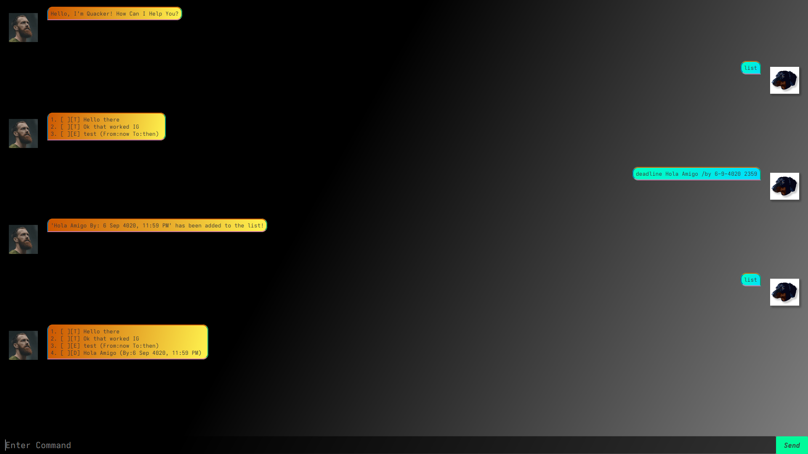

# Quacker User Guide



Quacker is a quick and easy To-Do list assistant ready to carry out your commands at a blazingly fast speed.

With commands covering all basic needs, Quacker is ready to store your To-Do lists for retrieval at any time and any place!

# Quick Note About Command Format
- Words in UPPER_CASE are the parameters to be supplied by the user.
e.g. in todo **TASK_NAME**, **TASK_NAME** is a parameter which can be used as **todo Buy Eggs**

- Items in square brackets are optional.
e.g **TASK_NAME** [#TAG] can be used as **todo Buy Eggs _#urgent_** or as **Buy Eggs**

- Any incorrect command will be met with an error message and the _recommended_ format to use said command.


# To Run The Program 

To quick run the program, using gradle execute the following command:
> ./gradlew run


## To List Currently Tasks: `list`
Displays list of current tasks, along with their current completion status.
```declarative
list
```

## To Mark a Task Completed: `mark`
By specifying a task number, it can be marked complete.

#### Syntax:
> mark [Task_Number]

```declarative
mark 1

1. [X][T] [Task_Name]
```


## To Unmark a Task Completed: `unmark`
By specifying a task number, it can be marked incomplete.

#### Syntax:
> unmark [Task_Number]

```declarative
unmark 1

1. [ ][T] [Task_Name]
```


## To Delete a Task: `delete`
By specifying a task number, it can be deleted from the list.

#### Syntax:
> delete [Task_Number]

```declarative
delete 1

The following task has been removed from your list:
[Task]
```


## To Find a Task: `find`
By specifying a task description, find **all** tasks that match. This command is **not** case sensitive.

#### Syntax:
> find [Task_Description]

```declarative
find hello there

Is This What You're Looking For?
1. [ ][T] HELLO THERE
4. [X][T] hello there
7. [X][T] Hello There
```


## To Create a To-Do Task: `todo`
By specifying a task description, a simple todo task is added to the list

#### Syntax:
> todo [Task_Description]

```declarative
todo Buy Eggs

'Buy Eggs' has been added to the list!
```


## To Create a Deadline Task: `deadline`
By specifying a task description, a deadline task is added to the list

#### Syntax:
> deadline [Task_Description] /by [DD-MM-YYYY HHmm]

```declarative
deadline Do Laundry /by 09-11-2001 0846

'Do Laundry By: 9 Sep 2001 8:46am' has been added to the list!
```


## To Create an Event Task: `event`
By specifying a task description, an event task is added to the list

#### Syntax:
> event [Task_Description] /from [Time/Date] /to [Time/Date]

```declarative
event Do Homework /from 9am /to 3pm

'Do Homework From:9am To:3pm' has been added to the list!
```


## Command Summary

| Command | Example                                   |
|------|-------------------------------------------|
| list | `list`                                    |
| mark | `mark 1`                                  |
| unmark | `unmark 2`                                |
| delete | `delete 3`                                |
| find | `find Do Dishes`                          |
| todo | `todo Buy Eggs`                           |
| deadline | `deadline Do Laundry /by 09-11-2001 0846` |
| event | `event Do Homework /from 9am /to 3pm`     |

